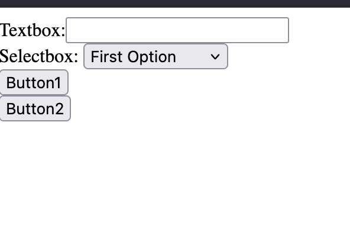

# Overview

The page that we want to send the response to is written inside the form tag as the action attribute.

We use "POST" as the metod for non-search applications. We use "GET" as the method for search forms. This way we can copy/paste search results or bookmark a search result, but not for other types of forms.
 
## Screenshot

