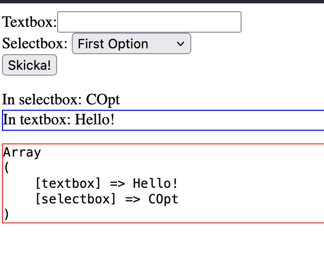

# Overview

This example showcases a self referencing form.

## Code

Compared to the form-response variant there are two main changes
* We change the action to the same name as the file. In this case `<form action='FormSelf.php' method='POST'>`
* We move the content from the response page to below the form tag.

This allows us to show the form and the result on the same page.
 
## Screenshot

