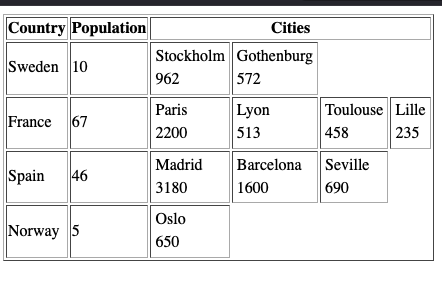

# Overview

This example creates a table with a nested inner table. We make a column in the inner table for each row in the outer table.

## Rendering data with table rows

We use nested tables to get an accessible way to display data connected using a 1:N relationship.

Each country has a number of cities. Each country is represented using a row in the outer table, and each city is represented using a column in the inner table. Each piece of information for a city is represented using a row in the inner table.

## Foreach statements

We use one foreach statement for countries and one foreach statement for each of the cities in the country.

```php
		foreach ($arr as $country) {
				echo "<tr>";
				echo "<td>".$country[0]."</td>";
				echo "<td>".$country[1]."</td>";
        ...
				echo "</tr>";
		}
```

We use a foreach statement for each city that renders the inner table inside a td tag in the outer table.
The inner table tag is generated once for each city and each piece of information is added as a row in the inner table.
Each city is therefore a __column__ in the outer table.

```php
				foreach($country[2] as $city){
						echo "<td>";
						echo "<table>";
						echo "<tr><td>".$city[0]."</td></tr>";	
						echo "<tr><td>".$city[1]."</td></tr>";
						echo "</table>";
						echo "</td>";
				}
``

## Screenshot


