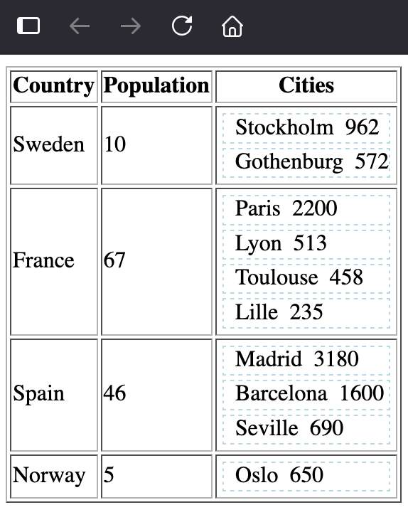

# Overview
This example makes use of span elements instead of table columns / rows.

## Rendering data with span tags
We render using span instead of table tags and table cell / row tags. 

We can use ARIA tags and table styling in css but the creators of html warns us that this approach has less accessibility.

> [!WARNING]
> Many of these widgets are fully supported in modern browsers. Developers should prefer using the correct semantic HTML element over using ARIA, if such an element exists. For instance, native elements have built-in keyboard accessibility, roles and states. However, if you choose to use ARIA, you are responsible for mimicking the equivalent browser behavior in script.

```php
				foreach($country[2] as $city){
						echo "<div role='table' aria-label='Semantic Elements' style='display:table;margin:3px;border:1px dashed lightblue;' >";
						echo "<span role='cell' >".$city[0]."</span>";	
						echo "<span role='cell' >".$city[1]."</span>";
						echo "</div>";
				}
```

## Screenshot


