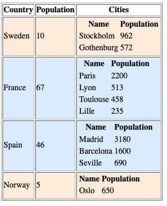

# Overview

This example makes use of conditional styling to format a table layout depending on the contents of that table.

## Rendering data with conditionally formatted table rows

We make code that compares the value of the content that we want to print and generates two alternate table row tags with distinct styling.

We can do this either with inlines styling.

```php
				if($country[1]>30){
						echo "<tr style='background:#def;'>";
				}else{
						echo "<tr style='background:#fed;'>";				
				}
```

Or preferrably with a class attribute to allow shared styling across the project without having to edit the php code.

```php
				if($country[1]>30){
						echo "<tr class='bluerow'>";
				}else{
						echo "<tr style='redrow'>";				
				}
```
## Screenshot


